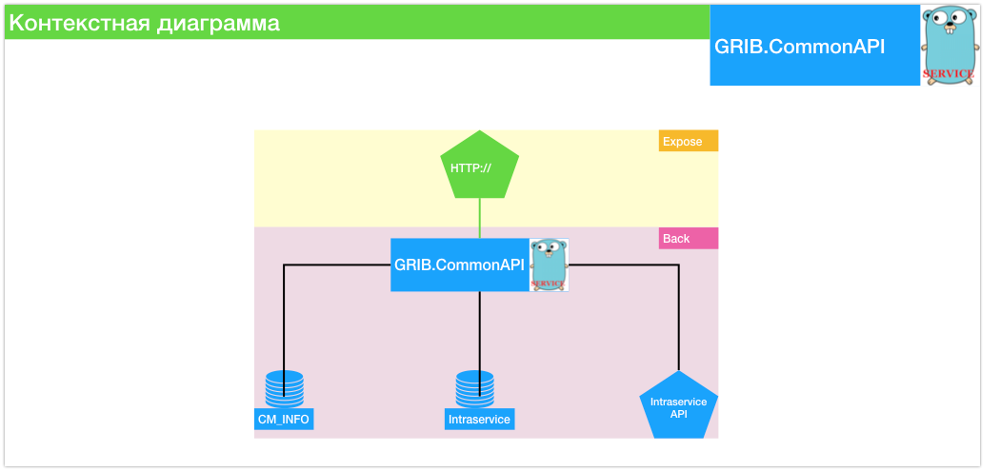

[](http://drone.watcom.ru/grib/commonapi)  [](http://drone.watcom.ru/grib/commonapi)  [](http://drone.watcom.ru/grib/commonapi) 
# CommonAPI - програмный интерфейс общего назначения.

## Назначение

Для разделения информации от места и способа ее хранения внутри системы и стандартизации ее использования
На момент создания и обновления API основными источниками информации служили базы данных:

- CM_INFO
- Intraservice (БД и API)
- базы клиентов CountMax 5.2.3

контекстная диаграмма представлена на рисунке 1


## Шаги необходимые выполнить перед первым началом работы с исходным кодом компонента

- Иметь настроенное Go (>1.13) окружение
- Импортировать проект в папку не входящую в директорию GOPATH т.к. применяется GO MODULES

## Шаги необходимые выполнить для построения компонента

- os Linux: `make build`
- os Windows: `go build -o commonapi`

**`CI:` drone.io -> docker image to hub.watcom.ru/commonapi**

## Шаги необходимые выполнить для получения результатов построения компонента

* Получить параметры подключения ко всем хранилищам и указать их в конфигурации;
* Приложение ориентировано на работе в Docker контейнере внутри корпоративной сети компании Ватком - запустить контейнер с нужными значениями переменных окружения и открытым ТСП портом для доступа к сервису:

```bash
docker image build -t="hub.watcom.ru/commonapi" .
docker run --name commonapi-customname -p 9090:8000 -e COMMAPI_HTTPD_HARDCODE_TOKEN=secret-token -d hub.watcom.ru/commonapi
```

* Так же можно поправить `docker-compose.yml` файл и запустить приложение командой `docker-compose up -d`;

### Deploy to kebernetes

Требуется иметь установленную утилиту kubectl доступ ... to be continued 

## Требования к окружению для работы компонента

- само приложение: Бинарный файл приложения и конфигурационный файл
- окружение: доступные базы данных CM_INFO, Intraservice, API Intraservice и параметры подключения к ним

## Описание параметров конфигурации компонента

Приоритет применения конфигурационных значений: параметры из конфиг файла `config.yaml` -> переменные окружения -> флаги с которыми запущено приложение  
Для работы с конфигурацией применяется go пакет [viper](https://github.com/spf13/viper) и метод `AutomaticEnv()`  

```golang
SetEnvPrefix("spf") // will be uppercased automatically
BindEnv("id")
os.Setenv("SPF_ID", "13") // typically done outside of the app
id := Get("id") // 13
```

В качестве префикса используется **`COMMAPI`**

Тогда чтобы переопределить значение из конф файла на значение в переменной окружения необходимо сделать так:  
задать в среде, в которой будет запускаться сервис, переменную окржения `COMMAPI_HTTPD_PORT=9090` тогда при запуске сервис будет пытаться занять ТСР порт `9090`

Пример конфигурации:

```yaml
app: # метаданные приложения
    name: 'commonapi' # наименование приложения
httpd:
    port: "8000" # http порт, который будет пытаться открыть приложения и принимать на него http запросы
    host: ""  # ip адрес хоста который будет занимать приложение, можно оставить пустым
    hardcode_token: "secret" # токен авторизации для работы с API: Authorization: Bearer secret
    allow_origins: # CORS requests allowed
    - "*" # for anybody
intraservice: # параметры подключения к Интрасервису
    dsn: "server=sd-test.watcom.ru;user id=commonapi;password=commonapi;port=1433;database=Intraservice;" # строка подключения к БД Intraservice
    sqltimeout_sec: 30 # таймаут с котрым работают запросы к БД, следует увеличить если база медленно отвечает
    url: "http://sd-test.watcom.ru" # URL адрес АПИ интрасервиса
    user: "tester" # пользователь для работы с интрасервисом
    pass: "watcom" # пароль пользователя для работы с интрасервисом
    httptimeout_sec: 15 # таймаут для работы с АПИ Интерасервиса, следует увелиить если АПИ медленно работает
cminfo: # параметры подключения к БД CM_INFO
    dsn: "server=study-app;user id=root;password=master;port=1433;database=CM_Info_Test;" # строка подключения к БД CM_INFO
    sqltimeout_sec: 30 # таймаут с котрым работают запросы к БД, следует увеличить если база медленно отвечает
env: develop # тип окружения в котором запускается сервис, production - логи в сокращенном формате
log:
    level: debug # уровень логирования сервиса: debug, info, warn, error
    file: "" # имя файла лога, если пусто или stdout - будет выводить в stdout, если указано имя фацйла, будет писать в него
consul: # параметры для авторегистрации и дерегистраии сервиса в CONSULe для service discovering-a
    url: "elk-01:8500" # адрес consul сервера
    serviceid: "commonapi-dev" # уникальный идентификатор сервиса, соответсвует имени контейнера (имена контейнеров во всей системе не должны совпадать)!
    address: "elk-01.watcom.local" # адрес/fqnd имя сервера по которому будет видент данный сервис, host docker машины
    port: 8000 # порт по которому доступны метрики и проверка здоровья сервиса снаружи
tags: "develop,grib,commonapi,office" # теги сервиса по которым будет осущестляться поиск и разметка в мониторинге, количетсво и порядок строго определенные
        # №1 окружение: develop, stage, production
        # №2 проект откуда сервис: countmax, grib, focus etc...
        # №3 семейство сервисов: commonapi, dbscanner, incidentmaker, transport.webui etc...
        # №4 локация/датацентр где работает сервис
```

### TODO

- [ ] Добавить конфиг по умолчанию и использовать его если файла конфигурации нет [issue#47](https://git.countmax.ru/grib/commonapi/issues/47)
- [ ] Добавить возможность создать файл конфига со значениями по умолчанию при запуске сервиса с опр флагом [issue#48](https://git.countmax.ru/grib/commonapi/issues/48)

## Особенности публикации и эксплуатации компонента

Приложение используется в виде запущенного docker контейнера под ручным управление через вэб интерфейс [portainer](https://www.portainer.io/)  
Как правило запущено 2 экземпляра приложения в stage среде на `elk-01` и в проде на `dworker-01/02`  

В качестве документации используется автогенерированная swagger speca - на нее перебрасывает при открытии браузера по адресу и порту приложения.  
Тестовая сборка доступна для ознакомления по адресу [elk-01.watcom.local:7007](http://elk-01.watcom.local:7007)  

### Authentication

На текущий момент реализована простая авторизация по токену, значение котрого задается в конфиге
```yaml
httpd:
    ...
    hardcode_token: "secret-token" # токен авторизации для работы с API: Authorization: Bearer secret
```

При вызове метода с авторизацией необходимо указать заголов в вэб запросе `Authorization: Bearer secret-token`

```bash
curl -X GET "http://elk-01.watcom.local:7007/v2/assets" \
-H "accept: application/json" \
-H "Authorization: Bearer secret-token"
```
